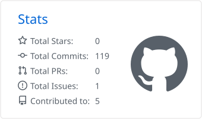
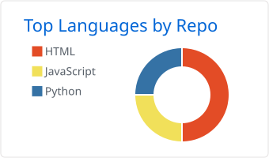

<!-- ===== ヘッダー：chemfig で描いた構造式が線画として描かれていく ===== -->
<picture>
  <source media="(prefers-color-scheme: dark)" srcset="assets/header-molecule-dark.svg">
  
</picture>

<!-- ===== タイピングアニメーション ===== -->

  🔗<a href="https://holy-negi.github.io/portfolio/">Visit my Portfolio</a>

---
<!-- ===== スタック ===== -->
### Stacks

<!--  -->

<!-- ===== プロジェクト ===== -->
### Projects

|                                                                           |                                                          |
| ------------------------------------------------------------------------- | -------------------------------------------------------- |
| [**synth-eln**](https://github.com/Holy-Negi/synth-eln)| 化学物性値計算・自動当量表生成機能を有した電子実験ノート |
| [**latex-for-chemists**](https://github.com/holy-negi/latex-for-chemists) | Coming later...                                          |

<!-- ===== 自動更新セクション（このマーカーの間は Actions が書き換えます） ===== -->
### Recent activities

<!-- ACTIVITY:START -->
- （直近の公開アクティビティはありません）

最終更新: 2026-09-04 08:16 JST
<!-- ACTIVITY:END -->

<!-- ===== 統計 ===== -->
### Stats

<picture>
  <source media="(prefers-color-scheme: dark)" srcset="profile-summary-card-output/github_dark/3-stats.svg">
  
</picture>
<picture>
  <source media="(prefers-color-scheme: dark)" srcset="profile-summary-card-output/github_dark/1-repos-per-language.svg">
  
</picture>

<picture>
  <source media="(prefers-color-scheme: dark)" srcset="https://raw.githubusercontent.com/Holy-Negi/holy-negi/output/snake-dark.svg">
  
</picture>

